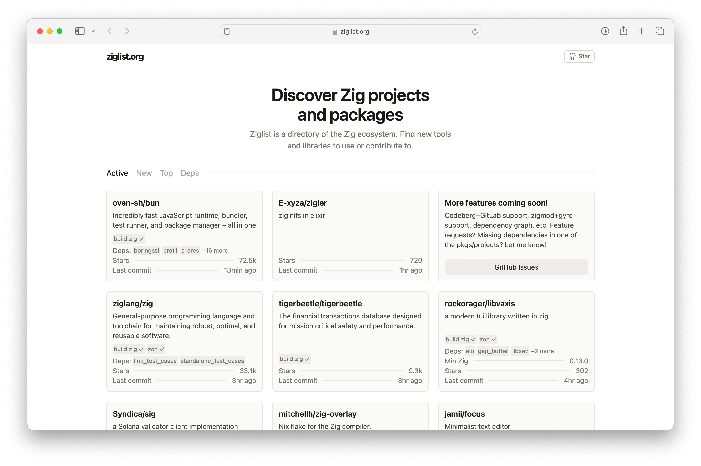

Ziglist is a web-based tool to discover Zig projects and packages. Visit [ziglist.org](https://ziglist.org).

How it works: Ziglist periodically indexes GitHub for Zig-related repositories, saves it in a SQLite database, and serves it. Ziglist lives in a single JavaScript [file](./src/main.jsx). It runs on the Deno runtime.

To run Ziglist locally:

- Install Deno, refer to the [documentation](https://docs.deno.com/runtime/manual/getting_started/installation/)
- `git clone https://github.com/pixqc/ziglist.git`
- `deno task dev`

Ziglist's visual design is inspired by [https://github.com/piotrkulpinski/openalternative](https://github.com/piotrkulpinski/openalternative)
